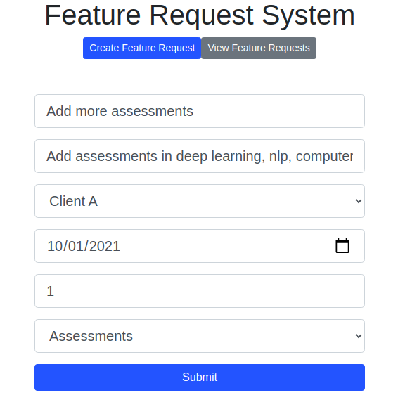
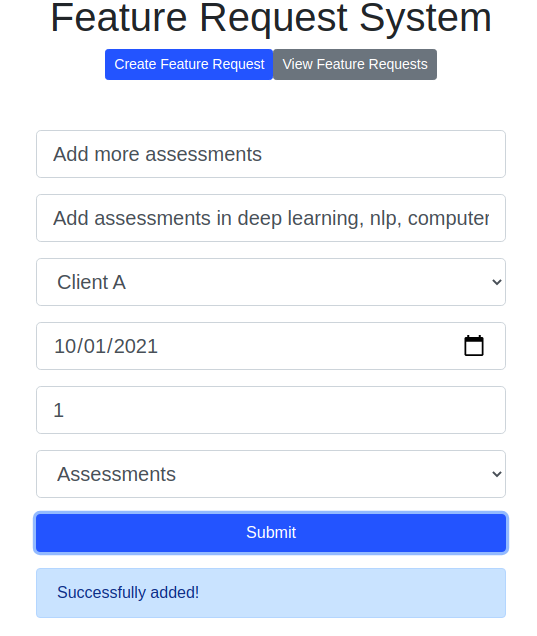
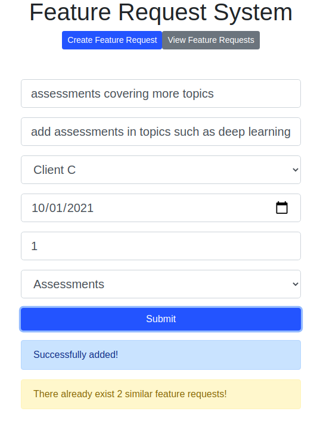
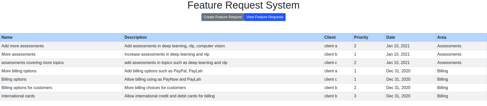

# Feature Request Application

This project helps a company employee register and view feature requests suggested by clients. The application provides an interface to input the required details of a request, and saves it to the database.

## Prerequisites
To run and use this application, the following prerequisites are required. The project with the below dependencies have been tested on Ubuntu 20.04 and Ubuntu 18.04 Servers.
- Python 3.6+ (With pip package manager)
- NPM 6.14+
- NodeJS
- Angular 8.0+ (With Angular CLI)
- Docker (For docker based deployment)
- Docker Compose (For docker based deployment)
- SpaCy NLP en_core_web_md model (Can be installed using `spacy download en_core_web_md` command, once SpaCy is installed in Python)

By default, the application uses the SQLite database using SQLAlchemy. However, this can be changed in the SQLAlchemy configuration to another database of the user's choice.

## Project Structure
The project directories are structured as follows:
```
|
|- backend          : Python project to run the Flask application
    |- data         : SQLite database folder (Not required if SQLAlchemy configuration changed to use different database)
    |- service      : Python files containing main logic of program
    |- test         : Test cases 
    |- app.py       : Main file to start Flask server
|- src              : Frontend code written in Angular
|- docker           : Docker related files for image creation and deployment
|- package.json     : NPM and Angular dependencies
|- requirements.txt : Python dependencies
```

## Features and Functioning
The following features are supported by the application.

### Creation of a new feature request
This feature enables an employee to register a new feature request in the system. It requires the following fields.
- Feature name : This field is the name of the feature the client wishes to add
- Description : This field is used to describe the feature. This feature is used in the feature similarity functionality of the application.
- Client name : The employee can select the client registering the complaint. Currently, only 3 clients are supported here.
- Target Date : Accepts only current and future dates.
- Priority : A custom priority number that can be set by the user. This number is modified to represent its criticality while adding to the database.
- Product Area : Domain of feature request. Currently, only 4 areas are supported.

This feature performs validations on the input data and adds it to the table. The priority is calculated and stored using the following methodology. The priorities are saved in the increasing order of natural numbers by default for a client, regardless of the input priority by the user. (For example: 1, 2, 3, 4... in order of addition). However, if the priority entered by the user already exists for the same client, then the feature request is saved with that priority, and other requests with equal or higher priority have their priorities increased by 1. For example, if 4 requests exist with Client A with priorities 2, 1, 3 and 4; if a new request is added with priority 2, then before adding this request, the priorities of the existing requests are modified as 3, 1, 4 and 5, in that order.


### Feature similarity detection
This feature helps the employee understand how popular a feature is, while adding the feature. This may help the employee understand the importance and demand of the feature, to prioritize it. Rather than just comparing the words in the feature descriptions, this feature uses Natural Language Processing algorithms to find out similarities between features using its meanings. While adding a new feature request, the description of the request is compared with each existing description to suggest to the user how many existing requests exist that are similar. The following workflow is used for calculation of the similarity.
- Preprocessing of sentences, including removing special characters, tokenization, removal of stop words (NLTK) from descriptions
- Using spacy's English natural language model to extract tokens, word2vec vectors, parts of speech, etc. 
- Using spacy's sentence similarity API to calculate the similarity score between 2 sentence vectors, ranging from 0 to 1.
- Returning sentences with a score above a threshold as similar. The current threshold defined is 0.7.


### Feature Requests listing
This feature lists all the features added in the database.



## Installation and Deployment
It is assumed that the prerequisites are installed in the system.
### Standalone
To install the dependencies, the following commands are run. To install the dependencies for the Angular project, we run the below command.

> npm install

To bind the angular CLI to NPM, you may need to run the following command.

> npm link @angular/cli

To install Python dependencies, run

> pip install -r requirements.txt

It is recommended that the dependencies for Python are installed in a virtual environment.
To do this, first install virtualenv, create a virtual environment and then activate it, before installing dependencies and running the program.

> pip3 install virtualenv

> python3 -m virtualenv venv

> source venv/bin/activate

To run the UI service, run the following command.

> ng serve

To run the backend Flask service, run the following command.

> python backend/app.py

Following this, the ports 4200 and 5000 will expose the frontend and backend programs respectively. For a quicker deployment, the Docker approach can be used.
### Docker
A single command can be used to create and deploy the docker containers (In background).

> docker-compose up --build -d

The `--build` argument can be skipped to avoid rebuilding the images. The ports, database persistence and other parameters can be modified in the `docker-compose.yml` file according to the Docker documentation.

## Future Improvements
### Feature Improvements
- Analysis of types of feature requests, using clustering of the descriptions. This can help the employee understand which are the most requested feature types.
- Dashboard to show feature requests grouped by client or request type.
- Deletion, editing features in listing table.
- More and comprehensive test cases.
### UI Improvements
- Usage of all Angular features, without some hardcoding.
- Validation of form fields in frontend with appropriate error message.
